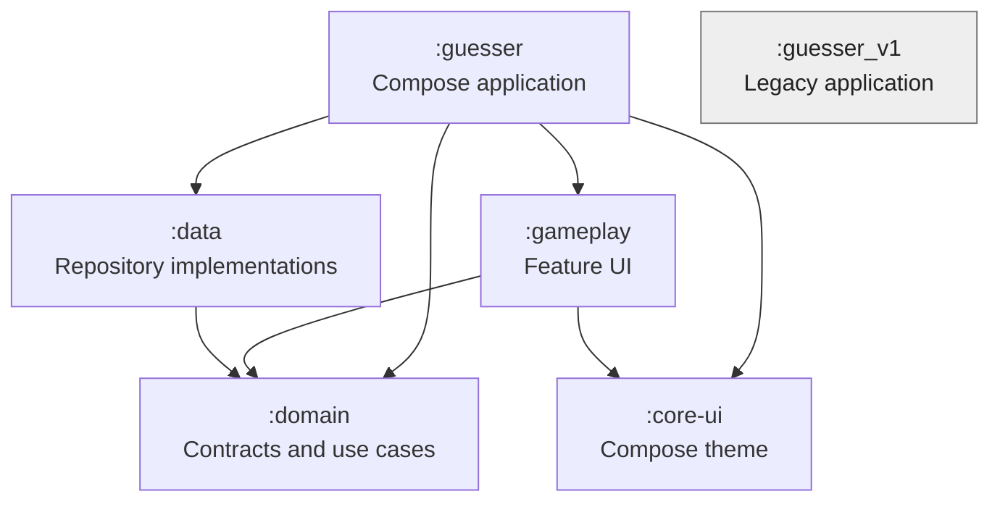
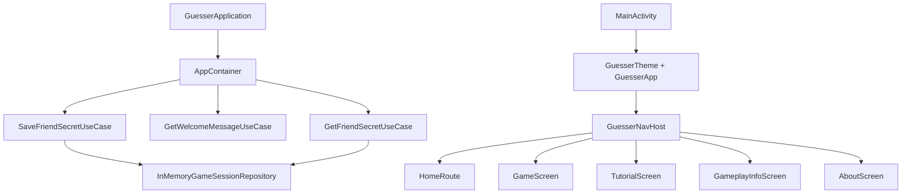
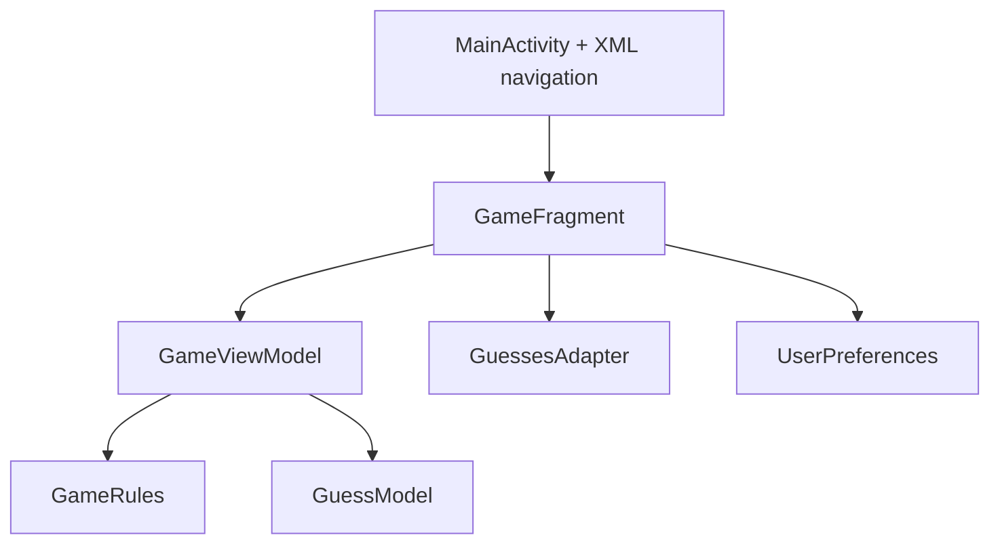

# Architecture

## Repository Shape

Guesser is now a multi-module Android repository with two independent
applications. The Compose revamp is the primary product direction; Guesser V1
is retained as an isolated reference and playable fallback.

There is deliberately no dependency edge between the revamp modules and
`:guesser_v1`.

## Module Responsibilities

| Module | Type | Responsibility |
| --- | --- | --- |
| `:guesser` | Android application | Application object, activity, composition root, and Navigation Compose host |
| `:gameplay` | Android library | Home UI/state plus Game, Tutorial, Gameplay, and About destinations |
| `:domain` | Kotlin/JVM library | Repository interfaces and thin application use cases |
| `:data` | Android library | Concrete app-info and in-memory game-session repositories |
| `:core-ui` | Android library | Material 3 colors, typography, and `GuesserTheme` |
| `:guesser_v1` | Android application | Complete legacy XML/View game, physically located in `app/` |

`settings.gradle` maps project `:guesser_v1` to directory `app`; directory and
Gradle project names therefore differ intentionally.

## Revamp Runtime Assembly

`GuesserApplication` lazily creates one `AppContainer`. The container performs
manual dependency injection by obtaining repositories from `RepositoryModule`
and constructing use cases. `MainActivity` enables edge-to-edge drawing and
sets Compose content. `GuesserApp` creates the navigation controller.

No dependency-injection framework is used.

## Navigation

`GuesserNavHost` owns five string routes:

| Route | Destination | Current status |
| --- | --- | --- |
| `home` | `HomeRoute` | Implemented |
| `game` | `GameScreen` | Placeholder with setup-type acknowledgement |
| `tutorial` | `TutorialScreen` | Placeholder |
| `gameplay_info` | `GameplayInfoScreen` | Placeholder |
| `about` | `AboutScreen` | Placeholder |

Forward and backward navigation use 320 ms horizontal slide transitions. The
home Start handler saves either the valid Double Player secret or `null` for
Single Player before navigating to `game`.

## Revamp State Ownership

| State | Owner | Lifetime |
| --- | --- | --- |
| Selected player mode | `HomeViewModel` / `HomeUiState` | Home navigation entry/ViewModel |
| Friend secret input | `HomeViewModel` / `HomeUiState` | Home navigation entry/ViewModel |
| Validation message | `HomeViewModel` / `HomeUiState` | Home navigation entry/ViewModel |
| Handed-off friend secret | `InMemoryGameSessionRepository` | `AppContainer` / application process |
| Navigation back stack | `NavHostController` | Compose activity instance |

`HomeUiState` is exposed as a read-only `StateFlow` and collected with
lifecycle awareness. There is no `SavedStateHandle`, database, DataStore use,
or persistent game session. Although `:data` declares a DataStore dependency,
current production code does not use it.

The app-info repository and welcome-message use case are wired and invoked
during `HomeViewModel` initialization, but the returned string is not currently
stored or rendered.

## Home UI

The home screen:

- uses full-screen Compose with edge-to-edge system bar padding;
- draws production artwork from `gameplay/res/drawable-nodpi`;
- scales control widths from the current screen width with upper/lower bounds;
- scrolls vertically and applies IME padding for compact displays;
- constrains mode interaction to two selectable radio-button regions;
- masks Double Player secret input;
- uses scale feedback instead of separate pressed artwork at runtime.

Original design files are preserved under `design_assets/raw_assets`. Runtime
resources are copied and normalized separately so source artwork is not a
module dependency.

## Shared UI

`:core-ui` supplies a Material 3 theme with static light/dark fallback schemes
and Android 12+ dynamic color enabled by default. `GuesserScreenScaffold`
provides the wood background and safe-area padding for secondary destinations.
`GuesserBackButton` supplies a 48 dp circular target and an auto-mirrored icon.

## Application Boundaries

The revamp application ID is `io.keval.apps.guesser`; the V1 application ID is
`com.thekeval.guesser`. Both target SDK 36, require API 21 or later, use Java
17, and are locked to portrait orientation.

## Guesser V1 Architecture

V1 remains a single-activity, fragment-based MVVM-style application:

It retains XML layouts, LiveData, ViewModel, `SharedPreferences`, custom keypad
logic, audio/haptic feedback, and the complete scoring loop. This code should
remain isolated unless a change is specifically intended for V1.
