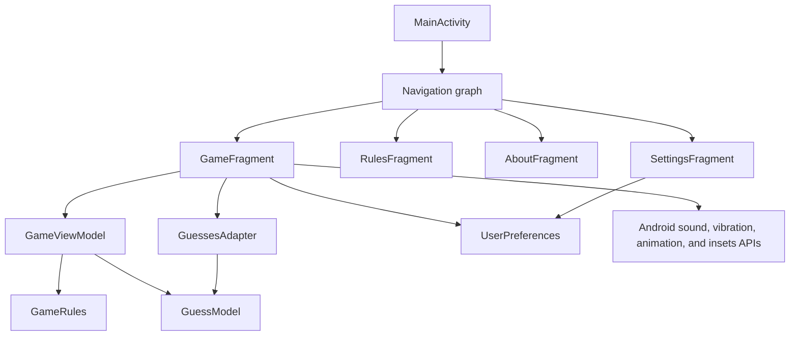

# Architecture

## Overview

Guesser is a single-module, single-activity Android application. Its current
design is a small MVVM-style separation rather than a full clean-architecture
stack: pure rules live in a domain object, mutable round state lives in a
ViewModel, and one fragment coordinates most UI and platform behavior.



## Component Responsibilities

| Component | Responsibility |
| --- | --- |
| `MainActivity` | Hosts the navigation fragment and drawer; locks the drawer outside the game destination |
| `GameFragment` | Binds controls, observes state, renders screens, handles dialogs and keypad input, and produces audio/haptic/visual feedback |
| `GameViewModel` | Owns the secret, guess history, stable guess IDs, and round state |
| `GameRules` | Validates codes, generates secrets, and computes remarks without Android dependencies |
| `GuessModel` | Immutable row data: stable ID, guessed number, and output remark |
| `GuessesAdapter` | Renders immutable guess rows with `ListAdapter` and `DiffUtil` |
| `UserPreferences` | Reads and writes feedback options through private `SharedPreferences` |
| `RulesFragment` / `AboutFragment` | Render static resource-backed content |
| `SettingsFragment` | Binds preference values to three switches |

## State Ownership

`GameViewModel` is scoped to `GameFragment`. It survives view recreation while
that fragment instance remains in the navigation stack, but it does not use
`SavedStateHandle` or other process-death persistence.

| State | Owner | Persistence |
| --- | --- | --- |
| Current secret | `GameViewModel.currentSecret` | In memory |
| Round status | `GameViewModel.gameState` | `LiveData`, in memory |
| Guess history | `GameViewModel.guesses` | `LiveData`, in memory |
| Next guess ID | `GameViewModel.nextGuessId` | In memory |
| App/Friend mode | `GameFragment.isAutoMode` | Fragment field only |
| Sound and vibration settings | `UserPreferences` | `SharedPreferences` |

This split has one important implication: mode is UI-owned while the active
round is ViewModel-owned. A future state refactor should place both in one
immutable screen state so configuration and process restoration cannot make
them disagree.

## Data Flow

```mermaid
sequenceDiagram
    participant Player
    participant Fragment as GameFragment
    participant ViewModel as GameViewModel
    participant Rules as GameRules
    participant Adapter as GuessesAdapter

    Player->>Fragment: Enter three unique digits and tap Check
    Fragment->>ViewModel: isValidUnique3Digits(guess)
    ViewModel->>Rules: isValidUniqueThreeDigitNumber(guess)
    Rules-->>Fragment: valid / invalid
    Fragment->>ViewModel: submitGuess(guess)
    ViewModel->>Rules: buildRemark(secret, guess)
    Rules-->>ViewModel: remark
    ViewModel->>ViewModel: append GuessModel; update state if winner
    ViewModel-->>Fragment: LiveData updates
    Fragment->>Adapter: submit reversed guess list
    Fragment-->>Player: row, sound, vibration, and animation
```

The domain and ViewModel layers do not depend on views. The reverse is not
true: `GameFragment` currently combines presentation, input policy, device
services, animation, and layout calculations.

## Navigation

`MainActivity` hosts one `NavHostFragment` and a drawer with Rules, About, and
Settings destinations. The game is the start destination. The drawer can open
only on that start destination; secondary screens use Up navigation.

## UI and Resources

- Layouts use XML, Material components, view binding, and data binding.
- `guess_view.xml` binds `GuessModel.number` and `GuessModel.output`.
- The game screen uses a `NestedScrollView`, a nested `RecyclerView`, and a
  custom keypad card.
- Window insets resize scroll and list areas around system bars and the keypad.
- The app is portrait-only.
- Day and night themes derive from Material 3 with project color resources.
- Sound effects are packaged in `res/raw`; no runtime download is required.

## Storage and External Boundaries

There is no network, database, account, or analytics layer. The only durable
data is three feedback settings in the private `guesser_prefs` preference
file. The older aggregate `sound_enabled` key remains as a migration fallback
for the two newer sound categories.

## Build Boundaries

The repository has one `app` module and one application ID:
`com.thekeval.guesser`. It targets Android SDK 36, supports API 21 and later,
and compiles for Java 17. The build still uses Groovy Gradle files.
