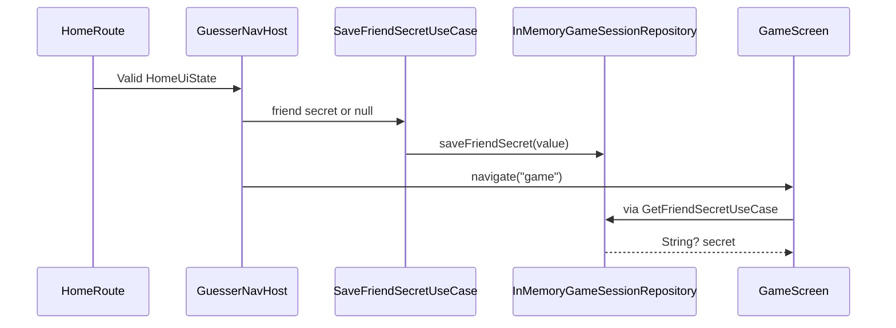

# Implementation Guide

## Revamp Startup

The new application starts through four small composition layers:

1. Android creates `GuesserApplication`.
2. Its lazy `AppContainer` creates repository implementations and use cases.
3. `MainActivity` enables edge-to-edge rendering and applies `GuesserTheme`.
4. `GuesserApp` creates a `NavHostController` and calls `GuesserNavHost`.

The application layer depends on all four support modules and is the only
place that assembles concrete `:data` repositories with `:domain` use cases.

## Manual Dependency Container

`RepositoryModule` constructs:

- `DefaultAppInfoRepository`, which returns `"Welcome"`;
- `InMemoryGameSessionRepository`, which holds one nullable friend secret.

`AppContainer` exposes:

- `GetWelcomeMessageUseCase`;
- `SaveFriendSecretUseCase`;
- `GetFriendSecretUseCase`.

These abstractions establish replaceable boundaries but are intentionally
minimal. The welcome result is currently discarded, and the session
repository has no clear/consume operation beyond saving `null`.

## Home State and Validation

`HomeUiState` contains:

```text
playerMode: SINGLE | DOUBLE
friendSecretNumber: String
secretValidationMessage: String?
```

`HomeViewModel` owns a `MutableStateFlow` internally and exposes an immutable
`StateFlow`.

### Mode Changes

Selecting Single Player clears the friend secret and any validation message.
Selecting Double Player preserves a previously entered secret and clears the
message.

### Secret Input

`onFriendSecretNumberChanged` filters input through `Char.isDigit` and keeps
at most three characters. Empty input shows no live error. Non-empty values
are validated with duplicate detection before length detection, so `11`
reports `Digits must be unique`.

### Starting

`canStartGame` always accepts Single Player and clears validation. Double
Player calls the same validator used during typing and accepts only three
unique digits.

`HomeRoute` invokes the outer Start callback only after `canStartGame` returns
true.

## Home Compose UI

`HomeScreen` is stateless: it renders `HomeUiState` and emits callbacks.
`HomeRoute` is the stateful boundary that creates the ViewModel and collects
state with `collectAsStateWithLifecycle`.

Notable implementation details:

- screen-width-derived dimensions keep artwork proportional;
- `verticalScroll`, status/navigation bar padding, and `imePadding` support
  compact layouts;
- the mode image is decorative while two transparent `selectable` regions
  expose radio-button semantics;
- the friend secret uses `BasicTextField`, numeric-password keyboard options,
  and `PasswordVisualTransformation`;
- image buttons collect press state and scale to 95 percent without a ripple;
- accessibility descriptions for home controls come from string resources.

## Session Handoff

The home destination does not pass a secret in a navigation route:



Single Player stores `null`; Double Player stores the validated secret. The
Game placeholder receives the value only to choose its explanatory copy and
never displays the secret. The repository is process-memory only.

## Navigation and Placeholder Screens

`GuesserNavHost` declares Home, Game, Tutorial, Gameplay, and About routes
with horizontal slide transitions. The four secondary screens use
`GuesserScreenScaffold` and `GuesserBackButton`.

Game distinguishes Single from Double Player by whether the retrieved secret
is null/blank. It does not generate a secret or implement a round. Tutorial,
Gameplay, and About delegate to a common `PlaceholderScreen` with temporary
hardcoded text.

## Theme and Assets

`:core-ui` defines `GuesserTheme`, colors, and default Material typography.
Android 12+ dynamic color is enabled unless a caller opts out. The wood-screen
foreground color is explicit white so placeholder content remains legible
regardless of the dynamic scheme.

Source artwork lives in `design_assets/raw_assets`. Runtime-sized copies live
in `gameplay/src/main/res/drawable-nodpi`. The runtime UI uses a scale press
effect and does not currently switch to the preserved `*.1` pressed images.

## Revamp Tests

- `HomeViewModelTest` covers duplicate-message consistency, empty-on-type
  versus required-on-start behavior, and valid Double Player setup.
- `GetWelcomeMessageUseCaseTest` verifies repository delegation.

There are no current Compose UI, navigation, repository, instrumentation, or
process-restoration tests.

## Guesser V1 Implementation

The complete game remains under `app/` as `:guesser_v1`:

- `GameRules` validates codes, generates unique secrets, and produces remarks.
- `GameViewModel` owns the secret, guess history, and four-state round machine.
- `GameFragment` handles rendering, dialogs, custom keypad input, layout,
  sound, vibration, animations, and confetti.
- `GuessesAdapter` renders newest-first immutable guess rows.
- `UserPreferences` persists result sound, keypad sound, and vibration options.

V1's scoring computes right-position matches, total overlap, and then
wrong-position matches as `overlap - right`. That implementation assumes both
inputs already satisfy the unique-three-digit contract.

V1 is not a shared library and is not imported by the revamp. Reusing its
rules requires intentionally porting the behavior into the new domain model,
not depending on `:guesser_v1`.
